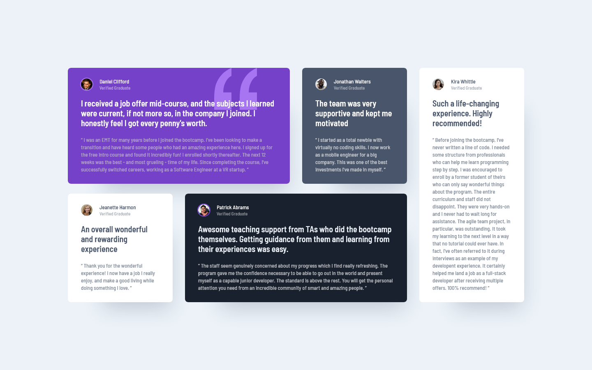

# Frontend Mentor - Testimonials grid section solution

This is a solution to the [Testimonials grid section challenge on Frontend Mentor](https://www.frontendmentor.io/challenges/testimonials-grid-section-Nnw6J7Un7). Frontend Mentor challenges help you improve your coding skills by building realistic projects. 

## Table of contents

- [Overview](#overview)
  - [The challenge](#the-challenge)
  - [Screenshot](#screenshot)
  - [Links](#links)
- [My process](#my-process)
  - [Built with](#built-with)
  - [What I learned](#what-i-learned)
  - [Continued development](#continued-development)
  - [Useful resources](#useful-resources)
- [Author](#author)

## Overview

### The challenge

Users should be able to:

- View the optimal layout for the site depending on their device's screen size

### Screenshot

### Links

- [Solution URL](https://github.com/loki-pepe/testimonials-grid-section)
- [Live Site URL](https://loki-pepe.github.io/testimonials-grid-section/)

## My process

### Built with

- Semantic HTML5 markup
- CSS custom properties
- CSS Grid
- Mobile-first workflow

### What I learned

I tried to get the desired layout using `grid-auto-flow: dense;`, but I couldn't get it to work the way I intended, so I finally opted to explicitly arrange the elements using `grid-template-areas`.

### Continued development

I would like to acquire a deeper knowledge of CSS Grid.

### Useful resources

- [Learn web development by web.dev](https://web.dev/learn) - Great courses for web development basics.
- [MDN Web Docs](https://developer.mozilla.org/) - An extensive resource on everything HTML and CSS.
- [CSS Grid by Wes Bos](https://cssgrid.io/) - A free tutorial for getting introduced to CSS Grid.

## Author

- GitHub - [Lovro Peraić](https://github.com/loki-pepe)
- Frontend Mentor - [@loki-pepe](https://www.frontendmentor.io/profile/loki-pepe)
